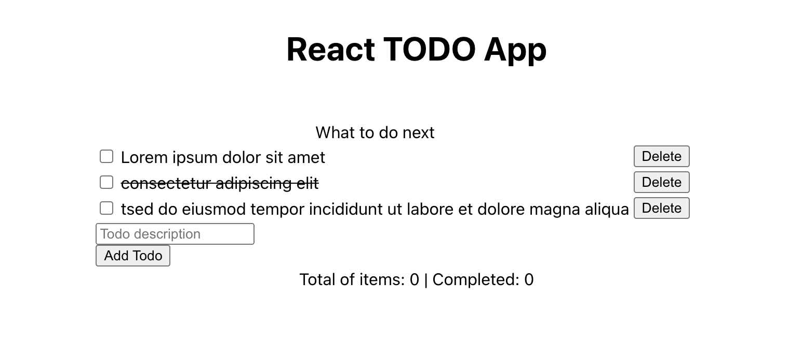

# React TODO app

✍️ A simple TODO application developed with React.

🧐**Design Decisions:**

It simply shows the features and aspects required for task management. The app's fundamental operation is based on a user's ability to build a list of tasks that can be stored, quickly removed, or declared complete. The information is very readable due to the lack of distractions, basic screen design, and well-thought-out typeface.

The basic functional buttons and filters are located at the top of the screen, facilitating accessibility for users with all screen devices. Even if the user scrolls to the bottom of the screen, the creation flow remains visible.

💭**Deployment:**

Git repo is integrated with Netlify that supports continous deployment wherein any code commit is automatically released to environment

[Demo](https://tender-easley-c063c8.netlify.app)

🤓**Assumptions:**
1. User can unmarked a completed task
2. **Validation**  - User must provide a value before it can be saved as a task

💥**The following features can be added to enhance functionality:**
1. Make it possible to search to-do lists.
2. Assign deadlines to each task.
3. Each task may be assigned to a category by the user.

__ __
__ __
__ __
## Coding task

🙀 *This application is currently half-baked and it needs your help to be completed!* 🙀

Your task is to implement the missing functionalities while delivering a clean application code and an amazing and beautiful UI experience to the application user.

## Requirements

### Business requirements

* "Add Todo" button:    creates a new TODO item (using the content from text input) that is displayed in the list of TODO items
* "Delete" button:      deletes the related TODO item
* Checkbox:             when checked, mark the related TODO item as completed
* Summary section ("Total of items" and "Completed"): counts are updated accordingly
* TODO list is saved on browser local storage (so it can be reloaded next time the app is loaded/or page is refreshed)
* Application looks professional (production ready):
    * you are free to change the design of the application if you feel that it makes sense
    * you are free to add any supporting library/package that you will need (e.g., UI, icons, utilities, etc)
    * adapt the code as much as you want so it is in accordance to the current web application development best practices

### Technical requirements

* Components are implemented as functional components
* Each React component is kept on its own file
* Clean code :)

## Submitting your code

For submission, please clone **this repo**, push the changes to **your repo** and inform us by email **the link to your repo** containing the solution code.

Also make sure to include:
* important design decisions
* assumptions you had to make in case the requirements are not very clear
* any relevant information needed to run your application (if different from the instructions in the next section)

# Getting Started with Create React App

This project was bootstrapped with [Create React App](https://github.com/facebook/create-react-app).

## Available Scripts

In the project directory, you can run:

### `yarn start`

Runs the app in the development mode.\
Open [http://localhost:3000](http://localhost:3000) to view it in the browser.

The page will reload if you make edits.\
You will also see any lint errors in the console.

### `yarn test`

Launches the test runner in the interactive watch mode.\
See the section about [running tests](https://facebook.github.io/create-react-app/docs/running-tests) for more information.

### `yarn build`

Builds the app for production to the `build` folder.\
It correctly bundles React in production mode and optimizes the build for the best performance.

The build is minified and the filenames include the hashes.\
Your app is ready to be deployed!

See the section about [deployment](https://facebook.github.io/create-react-app/docs/deployment) for more information.

### `yarn eject`

**Note: this is a one-way operation. Once you `eject`, you can’t go back!**

If you aren’t satisfied with the build tool and configuration choices, you can `eject` at any time. This command will remove the single build dependency from your project.

Instead, it will copy all the configuration files and the transitive dependencies (webpack, Babel, ESLint, etc) right into your project so you have full control over them. All of the commands except `eject` will still work, but they will point to the copied scripts so you can tweak them. At this point you’re on your own.

You don’t have to ever use `eject`. The curated feature set is suitable for small and middle deployments, and you shouldn’t feel obligated to use this feature. However we understand that this tool wouldn’t be useful if you couldn’t customize it when you are ready for it.

## Learn More

You can learn more in the [Create React App documentation](https://facebook.github.io/create-react-app/docs/getting-started).

To learn React, check out the [React documentation](https://reactjs.org/).

### Code Splitting

This section has moved here: [https://facebook.github.io/create-react-app/docs/code-splitting](https://facebook.github.io/create-react-app/docs/code-splitting)

### Analyzing the Bundle Size

This section has moved here: [https://facebook.github.io/create-react-app/docs/analyzing-the-bundle-size](https://facebook.github.io/create-react-app/docs/analyzing-the-bundle-size)

### Making a Progressive Web App

This section has moved here: [https://facebook.github.io/create-react-app/docs/making-a-progressive-web-app](https://facebook.github.io/create-react-app/docs/making-a-progressive-web-app)

### Advanced Configuration

This section has moved here: [https://facebook.github.io/create-react-app/docs/advanced-configuration](https://facebook.github.io/create-react-app/docs/advanced-configuration)

### Deployment

This section has moved here: [https://facebook.github.io/create-react-app/docs/deployment](https://facebook.github.io/create-react-app/docs/deployment)

### `yarn build` fails to minify

This section has moved here: [https://facebook.github.io/create-react-app/docs/troubleshooting#npm-run-build-fails-to-minify](https://facebook.github.io/create-react-app/docs/troubleshooting#npm-run-build-fails-to-minify)
